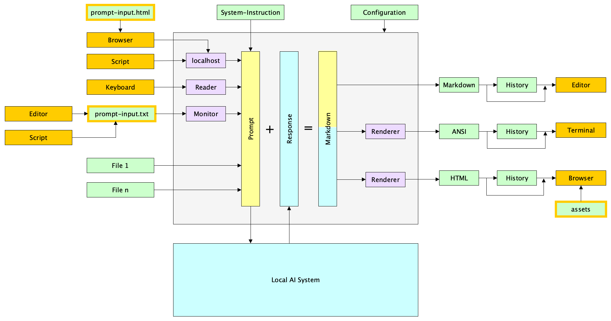

### Zweck

Dieses Programm ermöglicht die Interaktion mit lokalen KI-Modellen, um Prompts zu senden und Antworten in verschiedenen Formaten (Markdown, ANSI, HTML) zu empfangen. Das Ziel ist die nahtlose Integration von KI-Funktionen in den Arbeitsablauf des Benutzers durch die Unterstützung verschiedener Eingabe- und Ausgabekanäle sowie einer Historienverwaltung.

Das Programm ist als lokaler Client (LocAI-Client) konzipiert und kommuniziert über eine OpenAI-kompatible API mit einem lokalen Inferenz-Server (z. B. LM Studio, llama.cpp, Ollama). Es ist für Linux, macOS und Windows verfügbar.

### Lokale KI-Modelle und Gemma 4

Dieses Programm ist auf die Nutzung lokaler KI-Modelle ausgelegt. Ein herausragendes Beispiel hierfür ist **Gemma 4** (z. B. in der quantisierten Version `gemma-4-26b-a4b-it@iq2_m`). 

Die lokale Ausführung bietet entscheidende Vorteile:
*   **Datenschutz:** Alle Daten verbleiben lokal auf Ihrem System. Es findet kein Datentransfer in die Cloud statt.
*   **Kostenkontrolle:** Nach der Anschaffung der Hardware fallen keine API- oder Nutzungsgebühren an.
*   **Unabhängigkeit:** Keine Abhängigkeit von Internetverbindungen oder den Service-Verfügbarkeiten großer Cloud-Anbieter.

Gemma 4 und andere moderne Modelle (wie DeepSeek) unterstützen häufig sogenannte "Thinking"-Funktionen (Reasoning), bei denen das Modell vor der eigentlichen Antwort seine Gedankengänge formuliert. Der LocAI-Client erkennt diese internen Prozesse und bereitet sie in der HTML-Ausgabe sauber als ausklappbare Details auf.

### Funktionsumfang

*   **Flexible Eingabequellen:** Terminal, Datei-Polling (für Watch-Modus), HTTP (localhost:4343) und direkte Pipe-Übergabe.
*   **Datei-Handling im Prompt:**
    *   Lokale Dateien (Text, Code) werden direkt in den Prompt eingebunden.
    *   Automatisches MIME-Type Handling.
*   **Unterstützung moderner Modell-Features:**
    *   **Thinking Models:** Extrahierung und separate Darstellung der internen "Gedankengänge" (Thoughts) bei Reasoning-Modellen wie Gemma 4 oder DeepSeek.
    *   **System Instructions:** Steuerung des Modellverhaltens durch konfigurierbare System-Prompts.
*   **Konfigurierbare Ausgabeformate:**
    *   Markdown (für Editoren).
    *   ANSI (farbiges Terminal, mittels `glamour` Renderer).
    *   HTML (für Browser, inkl. Syntax-Highlighting, MathJax und Mermaid).
*   **History & Chat:**
    *   Speicherung des Verlaufs für alle Formate (HTML, Markdown, ANSI).
    *   Chat-Modus für konversationelle Interaktionen (Session-Gedächtnis).
*   **Konfiguration & Integration:**
    *   Detaillierte Konfiguration (YAML `locai-pro.yaml`, CLI-Flags).
    *   OS-spezifische Integration (native Benachrichtigungen für macOS, Linux, Windows; automatische Applikationsaufrufe).

### Installation und Konfiguration

Die Anwendung enthält intern alle für die Nutzung notwendigen Komponenten. Laden Sie die passende ausführbare Binärdatei für Ihr Betriebssystem aus dem Releases-Bereich herunter. Kopieren Sie die Anwendung in ein beliebiges Verzeichnis und starten Sie diese. Bei fehlenden Konfigurationsdateien (wie `locai-pro.yaml`) werden diese automatisch mit Standardwerten generiert.

### Voraussetzungen für den lokalen KI-Server

Der Client erwartet standardmäßig einen laufenden lokalen Inferenz-Server, der eine OpenAI-kompatible API bereitstellt. 
*   **Standard-Endpoint:** `http://localhost:1234/v1` (Dies ist der Standard-Port von z. B. LM Studio).
*   **API-Key:** Da der Server lokal läuft, wird lediglich ein Dummy-Key (`local-dummy-key`) verwendet. Es ist keine Registrierung bei einem Cloud-Dienst notwendig.

### Eingabe der Abfragen

Abfragen können über verschiedene Kanäle eingegeben werden: 
* Direkt im Terminal (interaktiv oder via Pipe `echo "Prompt" | locai-pro`)
* Über die Textdatei `prompt-input.txt`
* Über den integrierten HTTP-Server (`localhost` auf Port 4343)
* Für eine komfortablere Prompterstellung kann die beiliegende generierte Webseite `prompt-input.html` verwendet werden.

### Ausgabe der Abfrage+Antwort-Paare

Die Ergebnisse werden in verschiedenen Formaten ausgegeben: im Terminal (ANSI-farbig), als Markdown-Dateien und als HTML-Seiten. Die Browser-Ausgabe (`prompt-response.html` bzw. die History-Dateien) bietet umfangreiche Formatierungen inklusive Syntax-Highlighting, Formelsatz und Mermaid-Diagramm-Unterstützung.

### Benachrichtigungen

Benachrichtigungen informieren optional über den Start und Abschluss der Prompt-Verarbeitung. Da lokale Inferenz je nach Hardware (GPU/CPU) Zeit in Anspruch nehmen kann, ist dieses Feedback besonders hilfreich.

### Nutzung und Hinweise

Dieses Programm kann im Terminal für direkte Eingabe und Ausgabe genutzt werden oder als Controller mit Eingabe per Datei/Localhost und Ausgabe in GUI-Programmen.

Hinweise zum Nicht-Chat-Modus (Standard):
* Jeder Prompt wird unabhängig behandelt.
* Die KI erinnert sich nicht an frühere Interaktionen.
* Übergebene Dateien werden mit jedem Prompt erneut an das Modell gesendet.

Hinweise zum Chat-Modus (`-chatmode` Flag):
* Die KI merkt sich den Gesprächsverlauf innerhalb einer fortlaufenden Sitzung.
* Dateien werden nur mit dem ersten Prompt in den Kontext geladen.

### Datenschutzhinweise

Da alle Berechnungen und Datenverarbeitungen lokal auf Ihrem eigenen Rechner (oder Ihrem eigenen lokalen Server) stattfinden, bietet der LocAI-Client **100% Datenschutz**. 
Es werden keine Prompts, Dateien oder Antworten an das Internet gesendet. Daher können Sie bedenkenlos private Dokumente, Geschäftsgeheimnisse oder sensible Quellcodes verarbeiten.

### Technische Hinweise zum Kontextfenster

Jedes lokale KI-Modell hat ein maximales Kontext-Limit (Input + Output Tokens). Wenn das Modell beispielsweise mit einem Kontextfenster von 8192 Tokens geladen wird, entspricht dies in etwa 6000 englischen Wörtern. Stellen Sie sicher, dass Ihr lokaler KI-Server (z. B. LM Studio) so konfiguriert ist, dass der *Context Length* Parameter groß genug ist, um Ihre angehängten Dateien und den Chat-Verlauf aufzunehmen.

### Umgang mit Dateien und unterstützte Formate

Dateien können dem Kontext des Prompts auf verschiedene Arten hinzugefügt werden:

*   **Kommandozeile:** Ein Satz an Dateien (1-n) wird direkt als Argument übergeben (z. B. `locai-pro file1.txt bild.png dokument.pdf`).
*   **Listen-Datei (`-filelist`):** Statt viele Dateien einzeln in der Kommandozeile zu nennen, können diese in einer Datei aufgelistet werden (z.B. alle Dateien eines Projektes). Leere Zeilen sowie Zeilen, die mit `#` oder `//` beginnen, werden ignoriert.
*   **Terminal Inject:** Während der interaktiven Eingabe kann durch Voranstellen von `<<<` (z. B. `<<< input.txt`) der Inhalt einer Datei als Prompt geladen werden.

Das Programm erkennt Dateitypen automatisch anhand ihres Inhalts (MIME-Type) und wendet spezifische Verarbeitungslogiken an:

*   **Textdateien und Quellcode (`text/*`, JSON, XML, etc.):** 
    Werden als Klartext ausgelesen und inklusive Kopfzeilen (Dateiname und MIME-Type) sauber abgegrenzt in den textuellen Kontext des KI-Modells eingebettet.
*   **Bilddateien (`image/*`):** 
    Werden automatisch in Base64-codierte Data-URLs umgewandelt und nativ an das Modell durchgereicht. *Voraussetzung: Das verwendete lokale KI-Modell muss Vision-Fähigkeiten besitzen.*
*   **PDF-Dokumente (`application/pdf`):** 
    Werden vom Client abgefangen und mittels einer internen WebAssembly-Engine (PDFium) verarbeitet. Jede Seite des PDFs wird automatisch in ein einzelnes Bild (JPEG) konvertiert. Diese chronologische Bildfolge wird dann als Vision-Eingabe an das KI-Modell gesendet, wodurch auch komplexe Layouts und Grafiken innerhalb des Dokuments durch das Modell erfasst werden können.


*Dateiliste: Beispielinhalt von `sources.txt`:*
```text
# Quelldateien
main.go
utils.go

// Dokumentation
README.md
```

*Aufruf:*
```bash
locai-pro -filelist sources.txt
```

### Impliziter Cache im Chat-Modus (KV-Cache)

Wenn Sie den Chat-Modus nutzen, profitieren Sie vom impliziten Caching lokaler Inferenz-Server (dem sogenannten KV-Cache). Hierbei werden Dateien und vorherige Anweisungen nur beim ersten Aufruf vollständig evaluiert und tokenisiert. Bei Folgefragen in derselben Sitzung greift der lokale Server auf den bereits berechneten Cache zurück, was die Antwortzeiten drastisch verkürzt.

### Wichtige Parameter

*   **CandidateCount**: Anzahl der gewünschten Antwortvarianten (standardmäßig 1).

### Testumfeld und Referenzkonfiguration

Dieses Programm wurde in der folgenden Umgebung getestet und optimiert:

**Hardware für Client und Server:**
*   (Standard-) Apple MacBook Pro (M4-Prozessor)
*   16 GB Unified Memory (RAM)
*   10 CPU-Kerne, 10 GPU-Kerne

**Software & KI-Modell:**
*   **KI-Server:** `llama-server`
*   **KI-Modell:** Gemma 4 (Mixture-Of-Experts, 27 Milliarden Parameter) – ein mittelgroßes, leistungsstarkes Text- und Vision-Modell mit Reasoning (Thinking).

**Besonderheiten & Performanz:**
Das MacBook Pro mit M4-Prozessor und 16 GB RAM kommt bei diesem KI-Modell an seine Leistungsgrenze. Die gleichzeitige Nutzung vieler weiterer Applikationen führt zu Leistungseinbußen. 
Damit der KI-Server das Modell in den GPU-Speicher laden kann, muss das Limit für den durch die GPU nutzbaren Speicher vorab auf 14 GB (14336 MB) erhöht werden.

**Startsequenz des KI-Servers:**
Mit den folgenden Befehlen und Parametern kann der `llama-server` für das beschriebene Testumfeld gestartet werden:

```bash
sudo sysctl iogpu.wired_limit_mb=14336

llama-server \
--port 1234 \
--model /Users/bill/models/unsloth/gemma-4-26B-A4B-it-GGUF/gemma-4-26B-A4B-it-UD-IQ2_M.gguf \
--mmproj /Users/bill/models/unsloth/gemma-4-26B-A4B-it-GGUF/mmproj-F16.gguf \
--ctx-size 16384 \
--n-gpu-layers 99 \
--threads 4 \
--flash-attn auto \
--cache-type-k q8_0 \
--cache-type-v q8_0 \
--temperature 1.0 \
--top-k 64 \
--top-p 0.95 \
--reasoning on
```

**Reasoning/Thinking:**
Thinking verlangsamt das Antwortzeitverhalten und ist nicht für alle Anwendungsfälle erforderlich.
Der llama-server-Startparameter '--reasoning off' (llama-server) deaktiviert das Reasoning.

### Support und Programme

Programmfehler bitte in 'Issues' melden, Diskussionen und Fragen in 'Discussions'. Ausführbare Programme finden Sie im 'Releases'-Bereich.

***



***

### Purpose

This program allows interaction with local AI models to send prompts and receive responses in various formats (Markdown, ANSI, HTML). The goal is the seamless integration of AI features into the user's workflow by supporting various input and output channels as well as history management.

The program is designed as a local client (LocAI-Client) and communicates via an OpenAI-compatible API with a local inference server (e.g., LM Studio, llama.cpp, Ollama). It is available for Linux, macOS, and Windows.

### Local AI Models and Gemma 4

This program is designed for the use of local AI models. A prominent example of this is **Gemma 4** (e.g., in the quantized version `gemma-4-26b-a4b-it@iq2_m`).

Local execution offers crucial advantages:
*   **Privacy:** All data remains locally on your system. No data transfer to the cloud takes place.
*   **Cost Control:** After purchasing the hardware, there are no API or usage fees.
*   **Independence:** No reliance on internet connections or the service availability of large cloud providers.

Gemma 4 and other modern models (like DeepSeek) often support so-called "thinking" features (reasoning), where the model formulates its thought processes before providing the actual answer. The LocAI-Client detects these internal processes and cleanly formats them as collapsible details in the HTML output.

### Features

*   **Flexible Input Sources:** Terminal, file polling (for watch mode), HTTP (localhost:4343), and direct pipe forwarding.
*   **File Handling in the Prompt:**
    *   Local files (text, code) are directly embedded into the prompt.
    *   Automatic MIME-type handling.
*   **Support for Modern Model Features:**
    *   **Thinking Models:** Extraction and separate display of internal "thought processes" (thoughts) for reasoning models like Gemma 4 or DeepSeek.
    *   **System Instructions:** Control of model behavior via configurable system prompts.
*   **Configurable Output Formats:**
    *   Markdown (for editors).
    *   ANSI (colored terminal, via the `glamour` renderer).
    *   HTML (for browsers, incl. syntax highlighting, MathJax, and Mermaid).
*   **History & Chat:**
    *   Saving the history for all formats (HTML, Markdown, ANSI).
    *   Chat mode for conversational interactions (session memory).
*   **Configuration & Integration:**
    *   Detailed configuration (YAML `locai-pro.yaml`, CLI flags).
    *   OS-specific integration (native notifications for macOS, Linux, Windows; automatic application launches).

### Installation and Configuration

The application internally contains all the components necessary for use. Download the appropriate executable binary for your operating system from the Releases section. Copy the application to any directory and start it. If configuration files (such as `locai-pro.yaml`) are missing, they will automatically be generated with default values.

### Prerequisites for the Local AI Server

By default, the client expects a running local inference server that provides an OpenAI-compatible API.
*   **Default Endpoint:** `http://localhost:1234/v1` (This is the standard port of e.g., LM Studio).
*   **API Key:** Since the server runs locally, only a dummy key (`local-dummy-key`) is used. No registration with a cloud service is necessary.

### Input of Queries

Queries can be entered through various channels:
* Directly in the terminal (interactively or via pipe `echo "Prompt" | locai-pro`)
* Via the text file `prompt-input.txt`
* Via the integrated HTTP server (`localhost` on port 4343)
* For more comfortable prompt creation, the included generated webpage `prompt-input.html` can be used.

### Output of Query+Response Pairs

The results are output in various formats: in the terminal (ANSI-colored), as Markdown files, and as HTML pages. The browser output (`prompt-response.html` or the history files) offers extensive formatting including syntax highlighting, typesetting of formulas and Mermaid diagram support.

### Notifications

Notifications optionally inform about the start and completion of prompt processing. Since local inference can take time depending on the hardware (GPU/CPU), this feedback is particularly helpful.

### Usage and Notes

This program can be used in the terminal for direct input and output or as a controller with input via file/localhost and output in GUI programs.

Notes on the non-chat mode (default):
* Each prompt is treated independently.
* The AI does not remember previous interactions.
* Passed files are sent to the model again with each prompt.

Notes on the chat mode (`-chatmode` flag):
* The AI remembers the conversation history within an ongoing session.
* Files are only loaded into the context with the first prompt.

### Privacy Notice

Since all calculations and data processing take place locally on your own computer (or your own local server), the LocAI-Client offers **100% privacy**.
No prompts, files, or responses are sent to the internet. Therefore, you can safely process private documents, trade secrets, or sensitive source code.

### Technical Notes on the Context Window

Every local AI model has a maximum context limit (input + output tokens). For example, if the model is loaded with a context window of 8192 tokens, this corresponds to approximately 6000 English words. Ensure that your local AI server (e.g., LM Studio) is configured so that the *Context Length* parameter is large enough to accommodate your attached files and the chat history.

### File Handling and Supported Formats

Files can be added to the context of the prompt in various ways:

*   **Command Line:** A set of files (1-n) is passed directly as an argument (e.g., `locai-pro file1.txt picture.png document.pdf`).
*   **List File (`-filelist`):** Instead of naming many files individually in the command line, they can be listed in a file (e.g., all files of a project). Empty lines as well as lines starting with `#` or `//` are ignored.
*   **Terminal Inject:** During interactive input, prepending `<<<` (e.g., `<<< input.txt`) can load the contents of a file as a prompt.

The program automatically detects file types based on their content (MIME type) and applies specific processing logic:

*   **Text files and source code (`text/*`, JSON, XML, etc.):**
    Are read as plain text and clearly separated, including headers (file name and MIME type), before being embedded into the textual context of the AI model.
*   **Image files (`image/*`):**
    Are automatically converted into Base64-encoded Data URLs and passed natively to the model. *Prerequisite: The used local AI model must have vision capabilities.*
*   **PDF documents (`application/pdf`):**
    Are intercepted by the client and processed using an internal WebAssembly engine (PDFium). Each page of the PDF is automatically converted into a single image (JPEG). This chronological sequence of images is then sent as vision input to the AI model, allowing complex layouts and graphics within the document to be captured by the model.

*Filelist: Example content of `sources.txt`:*
```text
# Source files
main.go
utils.go

// Documentation
README.md
```

*Invocation:*
```bash
locai-pro -filelist sources.txt
```

### Implicit Cache in Chat Mode (KV Cache)

If you use the chat mode, you benefit from the implicit caching of local inference servers (the so-called KV cache). Here, files and previous instructions are only fully evaluated and tokenized upon the first invocation. For follow-up questions in the same session, the local server relies on the already calculated cache, which drastically reduces response times.

### Important Parameters

*   **CandidateCount**: Number of desired response variants (default is 1).

### Test Environment and Reference Configuration

This program was tested and optimized in the following environment:

**Hardware for Client and Server:**
*   (Standard) Apple MacBook Pro (M4 processor)
*   16 GB Unified Memory (RAM)
*   10 CPU cores, 10 GPU cores

**Software & AI Model:**
*   **AI Server:** `llama-server`
*   **AI Model:** Gemma 4 (Mixture-Of-Experts, 27 billion parameters) – a medium-sized, powerful text and vision model with reasoning (thinking).

**Peculiarities & Performance:**
The MacBook Pro with M4 processor and 16 GB RAM reaches its performance limits with this AI model. The simultaneous use of many other applications leads to performance degradation.
In order for the AI server to load the model into the GPU memory, the limit for the memory usable by the GPU must be increased to 14 GB (14336 MB) beforehand.

**Startup Sequence of the AI Server:**
With the following commands and parameters, the `llama-server` can be started for the described test environment:

```bash
sudo sysctl iogpu.wired_limit_mb=14336

llama-server \
--port 1234 \
--model /Users/bill/models/unsloth/gemma-4-26B-A4B-it-GGUF/gemma-4-26B-A4B-it-UD-IQ2_M.gguf \
--mmproj /Users/bill/models/unsloth/gemma-4-26B-A4B-it-GGUF/mmproj-F16.gguf \
--ctx-size 16384 \
--n-gpu-layers 99 \
--threads 4 \
--flash-attn auto \
--cache-type-k q8_0 \
--cache-type-v q8_0 \
--temperature 1.0 \
--top-k 64 \
--top-p 0.95 \
--reasoning on
```

**Reasoning/Thinking:**
Thinking slows down response times and is not necessary for all use cases.
The llama-server startup parameter `--reasoning off` (llama-server) deactivates reasoning.

### Support and Programs

Please report program errors in 'Issues', and discussions and questions in 'Discussions'. Executable programs can be found in the 'Releases' section.
